# Arquitectura del Pipeline OSINT Peru 2026

## Diagrama de Flujo Principal

```mermaid
flowchart TB
    subgraph INGESTA["📥 INGESTA"]
        API[NewsAPI.ai]
        SCOPE[newsapi_scope_peru.yaml]
        INGEST[newsapi_ai_ingest.py]
        RAW[(data/raw/*.json)]
        
        SCOPE --> INGEST
        API --> INGEST
        INGEST --> RAW
    end
    
    subgraph PROCESO["⚙️ PROCESAMIENTO"]
        NORM[normalize_newsapi_ai.py]
        PARQUET[(data/interim/*.parquet)]
        LOAD[load_newsapi_ai_to_dw.py]
        DEDUPE[dedupe_newsapi_ai_in_duckdb.py]
        
        RAW --> NORM
        NORM --> PARQUET
        PARQUET --> LOAD
        LOAD --> DEDUPE
    end
    
    subgraph DW["🗄️ DATA WAREHOUSE"]
        STG[stg_news_newsapi_ai]
        STG_DEDUP[stg_news_newsapi_ai_dedup]
        
        DEDUPE --> STG
        DEDUPE --> STG_DEDUP
    end
    
    subgraph GEO["🌍 GEO-RESOLUCIÓN"]
        LOC_CAND[run_location_candidates.py]
        GEO_RES[run_geo_resolve_incidents.py]
        GAZ[(dim_places_pe)]
        MAP[(map_incident_place)]
        
        STG_DEDUP --> LOC_CAND
        LOC_CAND --> GEO_RES
        GAZ --> GEO_RES
        GEO_RES --> MAP
    end
    
    subgraph INCIDENTS["📋 INCIDENTES"]
        EXTRACT[extract_baseline.py]
        ACLED[acled_rules.py]
        STG_INC[(stg_incidents_extracted)]
        FCT[(fct_incidents)]
        
        STG_DEDUP --> EXTRACT
        EXTRACT --> ACLED
        ACLED --> STG_INC
        MAP --> FCT
        STG_INC --> FCT
    end
    
    subgraph OUTPUT["📊 SALIDA"]
        DASH[Dashboard Streamlit]
        EXPORT[Exportación CSV/Excel]
        
        FCT --> DASH
        FCT --> EXPORT
    end
```



## Flujo de Datos por Tabla


## Clasificación ACLED

```mermaid
mindmap
  root((ACLED))
    Battles
      Armed clash
      Government regains territory
      Non-state actor overtakes territory
    Explosions/Remote violence
      Chemical weapon
      Air/drone strike
      Suicide bomb
      Shelling/artillery
      Remote explosive
      Grenade
    Protests
      Peaceful protest
      Protest with intervention
      Excessive force against protesters
    Riots
      Violent demonstration
      Mob violence
    Violence against civilians
      Sexual violence
      Attack
      Abduction/forced disappearance
    Strategic developments
      Agreement
      Arrests
      Change to group activity
      Disrupted weapons use
      Headquarters established
      Looting/property destruction
      Non-violent transfer
      Other
```

## Scripts y Comandos


## Grupos Temáticos (Scope YAML)

| Grupo | Prioridad | ACLED Event Type | Keywords |
|-------|-----------|------------------|----------|
| elections | 1 | Strategic developments | elecciones, candidato, JNE |
| political_violence | 1 | Violence against civilians | atentado, asesinato político |
| protests | 1 | Protests | protesta, marcha, paro |
| terrorism | 1 | Explosions/Remote violence | terrorismo, Sendero, VRAEM |
| organized_crime | 2 | Violence against civilians | narcotráfico, sicariato |
| security_forces | 2 | Battles | PNP, militares, operativo |
| violent_crimes | 2 | Violence against civilians | homicidio, feminicidio |
| infrastructure | 3 | Strategic developments | bloqueo, toma de carretera |
| explosions | 2 | Explosions/Remote violence | explosión, bomba, artefacto |
| disasters | 3 | Strategic developments | huaico, inundación, sismo |
| accidents | 3 | Strategic developments | accidente, volcadura |
| health | 3 | Strategic developments | brote, epidemia |
